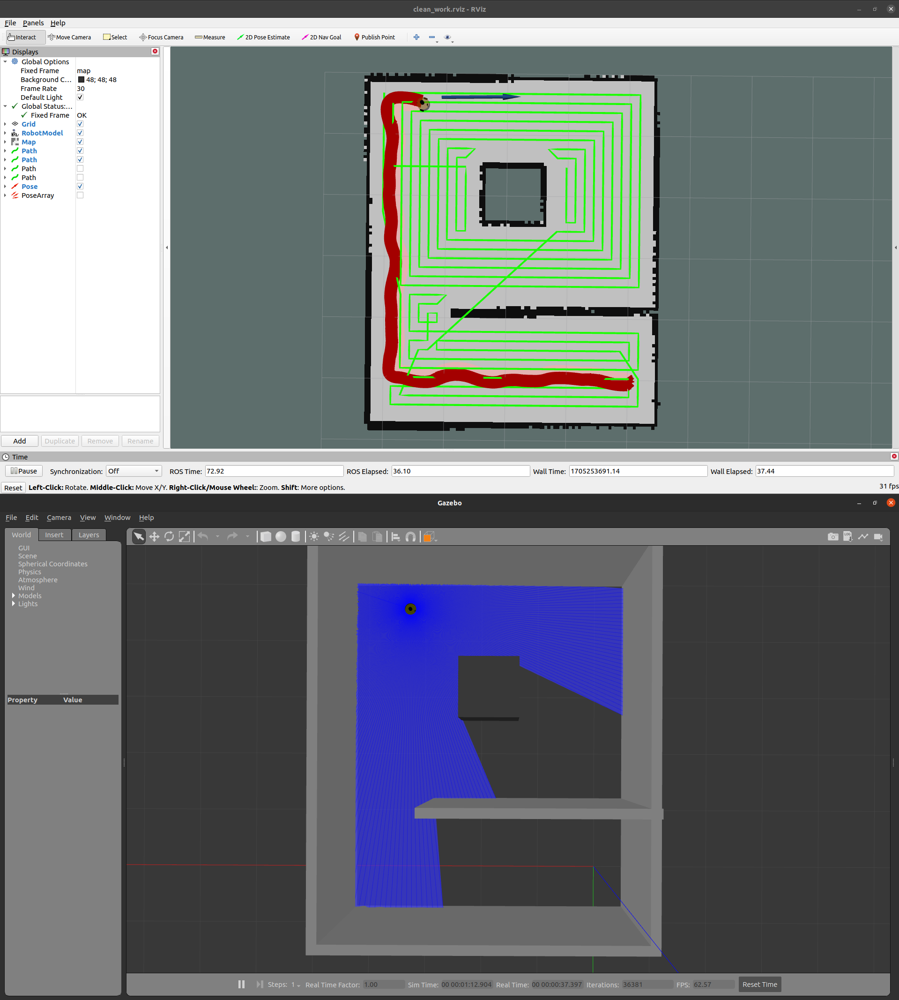

# Simulation of Sweeping Robot in ROS(Noetic)
- 
- [demo video](https://www.bilibili.com/video/BV1Fe41117gR/?share_source=copy_web&vd_source=e67cc43f2e8443b722a5f50ef79db03e)

## English
### Package Description
- **robot**: Contains the .urdf file for the cleaning robot and the .world file for the environment.
- **m-explore**: Open-source explore_lite algorithm.
- **manual_nav**: Package for manual mapping and manual navigation.
- **auto_nav**: Package for autonomous mapping and autonomous navigation. 
    - *path_planning.cpp*: Contains the path planning code for the cleaning robot.
    - *path_planning_node.cpp*: Node responsible for publishing the planned path.
    - *next_goal.cpp*: Node responsible for publishing the next goal point.

### Usage Instructions
1. Compile the project in the root directory: ``catkin_make``
2. Refresh the environment variables: ``source devel/setup.bash``
3. Depending on the functionality you want to run: 
    - For autonomous mapping: ``roslaunch auto_nav auto_slam.launch`` After mapping, save the map using ``roslaunch auto_nav save_map.launch``
    - For autonomous navigation: ``roslaunch auto_nav clean_work.launch``
    - For manual mapping: ``roslaunch manual_nav slam.launch`` After mapping, save the map using ``roslaunch manual_nav save_map.launch``
    - For manual navigation: ``roslaunch manual_nav nav.launch``

### Reference Links
- [https://github.com/hrnr/m-explore](https://github.com/hrnr/m-explore)
- [https://github.com/peterWon/CleaningRobot](https://github.com/peterWon/CleaningRobot)
- [https://github.com/mywisdomfly/Clean-robot-turtlebot3](https://github.com/mywisdomfly/Clean-robot-turtlebot3)


## 中文
### 功能包说明
- **robot** 包含扫地机器人的.urdf文件和环境的.world文件
- **m-explore** 开源的explore_lite算法
- **manual_nav** 手动建图和手动导航的功能包
- **auto_nav** 自主建图和自主导航的功能包
    - *path_planning.cpp* 为扫地路径规划代码（**新：使用A*算法实现全覆盖路径规划**）
    - *path_planning_node.cpp* 发布规划好的路径的节点
    - *next_goal.cpp* 发布下一个目标点的节点
    - *sequential_goal.cpp* 顺序目标点管理节点

### 🆕 最新更新：A*全覆盖路径规划算法
本项目已将原有的神经网络式路径规划算法完全重构为基于A*算法的全覆盖路径规划系统：

#### 核心特性
- 🎯 **A*算法保证**：确保找到最优路径
- 🗺️ **全覆盖策略**：网格划分确保不遗漏任何区域  
- 🔧 **路径优化**：自动平滑和优化路径
- 📊 **性能可控**：计算复杂度和内存使用可预测
- 🛡️ **稳定可靠**：避免死锁，算法确定性强

#### 快速测试
```bash
# 测试A*路径规划算法
./test_astar_coverage.sh

# 或使用Python验证器
python3 validate_astar.py

# 启动完整清扫系统
./start_intelligent_cleaning.sh smart
```

#### 相关文档
- `ASTAR_COVERAGE_ALGORITHM_GUIDE.md` - 详细算法实现指南
- `ASTAR_IMPLEMENTATION_SUMMARY.md` - 算法改造完成报告

### 使用说明
1. 在该工程的根目录编译项目： ``catkin_make``
2. 刷新环境变量： ``source devel/setup.bash``
3. 根据你想运行的功能：
    - 若要自主建图：``roslaunch auto_nav auto_slam.launch`` 建图完成后``roslaunch auto_nav save_map.launch``保存地图
    - 若要自主导航：``roslaunch auto_nav clean_work.launch``
    - 若要手动建图：``roslaunch manual_nav slam.launch`` 建图完成后``roslaunch manual_nav save_map.launch``保存地图
    - 若要手动导航：``roslaunch manual_nav nav.launch``

### 参考链接
- [https://github.com/hrnr/m-explore](https://github.com/hrnr/m-explore)
- [https://github.com/peterWon/CleaningRobot](https://github.com/peterWon/CleaningRobot)
- [https://github.com/mywisdomfly/Clean-robot-turtlebot3](https://github.com/mywisdomfly/Clean-robot-turtlebot3)
